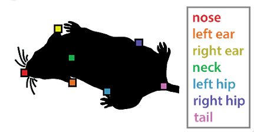

# Behavior ML Analysis

Contains DLC tracks, behavior annotations (in BORIS) and trained DLC models for a couple of applications. 

These models include:
* A pilot study of mouse social interaction videos. Contains adult and juvenile
* Overnight videos of a single mouse

The DLC labeling tracks 7 points on the mouse, which matches the multi-agent behavior analysis challenge [here](https://www.aicrowd.com/challenges/multi-agent-behavior-representation-modeling-measurement-and-applications/).

Also includes notebooks for DLC inference. Once inference is performed, also includes notebooks that can perform supervised or unsupervised learning and other downstream tasks. Some of these are generic, to be adapted to your own project, and some are for specific projects. 

## To use

The notebooks assume `deeplabcut` is setup in your environment, along with our `DLC` post-analysis package [`behaveml`](https://github.com/benlansdell/behaveml) and common python data science packages. See `requirements.txt` for details. 
